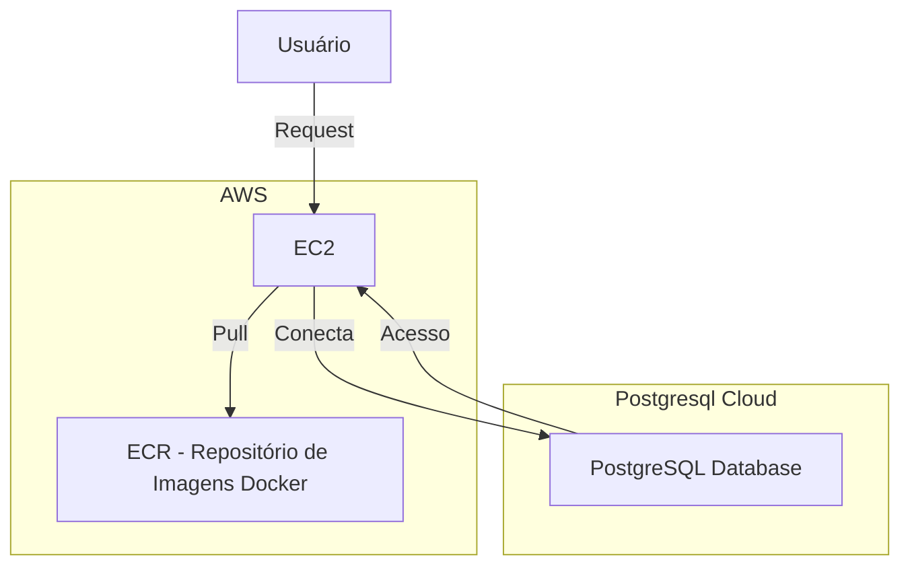

# Python CRUD

Uma api Graphql em python usando o Flask e o Graphene. Como ORM está usando o SQLAlchemy para a conecção com o Postgresql, além do terraform e Ansible para gerenciar a Infraestrutura na AWS

## Infraestrutura

A Infraestrutura do projeto é inteiramente feita na AWS, uma EC2 com ip elastico que puxa um container Docker da ECR com a ajuda do Ansible

Claro! Abaixo está um exemplo de diagrama usando a sintaxe do Mermaid, que representa a infraestrutura do seu projeto:



## Projeto

O projeto tem 2 rotas REST, sendo uma para gerar um JWToken para autenticação e outro sendo a rota do Graphql

### Rota de Autenticação

A rota respetivamente*Post - /api** retorna um JWToken para autenticação.

**Resposta:**

```json
{
    "token": "jwt_token"
}
```

### Rota do Graphql

A rota **Any - /graphql** retorna o resultado da requisição da API Graphql. Para isso, basta passar o JWToken na **Authorization** no header da requisição usando o formato **Bearer jwt_token**.

#### Queries

- **Buscar usuário**: Retorna um usuário com o id informado.

```graphql
{
    getUser(id: 1)  {
        id
        name
        email
        message
        success
    }
}
```

- **Buscar contrato**: Retorna um contrato com o id informado.

```graphql
getContract(id: 1) {
        user_id
        id
        fidelity
        amount
        message
        user {
            id
            name
            email
        }
        description
        created_at
    }
```

- **Listar contratos de um usuário**: Retorna uma lista de contratos de um usuário com o id informado.

```graphql
 getContractsByUser(user_id: 1) {
        Contracts {
            id
            user_id
            fidelity
            amount
            description
            created_at
        }
        nextToken
    }
```

#### Mutations

- **Criar usuário**: Cria um novo usuário.

```graphql
createUser(input: {
        name: "John test", email: "john.test@example.com"
    }) {
        email
        id
        name
        message
        success
    }
```

- **Atualizar usuário**: Atualiza os dados de um usuário.

```graphql
updateUser(id: 1, input: {name: "John test2", email: "john2.test@example.com"}) {
      id
      name
      email
      message
      success
  }
```

- **Deletar usuário**: Deleta um usuário.

```graphql
deleteUser(id: 2) {
        message
        success
    }
```

- **Criar contrato**: Cria um novo contrato.

```graphql
createContract(input: {user_id: 1, fidelity:3, amount:2.4, description: "Teste"}) {
      id
      amount
      fidelity
      description
      created_at
      message
      success
  }
```

- **Atualizar contrato**: Atualiza os dados de um contrato.

```graphql
updateContract(id:1, input: {fidelity:8, amount:2.4, description: "Teste"}) {
      id
      amount
      fidelity
      description
      created_at
      message
      success
  }
```

- **Deletar contrato**: Deleta um contrato.

```graphql
deleteContract(id: 1) {
        message
        success
    }
```

## Configuração

Agora vamos ver como podemos colocar isso pra rodar. Existe 3 formar de rodar esse projeto:

- **Local**
- **Docker-compose**
- **Cloud**

### Configurações iniciais

Para começar precisamos ter o projeto na nossa maquina, para isso basta clonar o repositório

```bash
git clone https://github.com/LucaGuidoRegolini/python-crud
cd python-crud
```

Uma vez com o projeto clonado podemos iniciar as configurações.

### Local

Ao rodar locamente o projeto ira rodar diretamente no terminal, é o metodo que precisa de menos recursos, mas deve ser usado apenas para testes.

> **Aviso:** Este metodo requer um que você já tenha um banco de dados PostgreSQL funcionando.

#### **Requisitos**

- Python 3.10 ou superior

#### Configurações

- Criação do .env

Primeiro precisamos criar o .env, para isso basta copiar o arquivo .env.example e renomear para .env.Dentro desse arquivo vai ter 2 variáveis que estão sem valor

```bash
JWT_SECRET=
DATABASE_URL=
DEBUG_MODE=True
```

O JWT_SECRET pode ser qualquer string. Já o DATABASE_URL tem que ser uma url PostgreSQL.

```bash
JWT_SECRET="Qualquer string"
DATABASE_URL="postgresql+psycopg2://postgres:postgres@db:5432/mydatabase" # Url de exemplo
DEBUG_MODE=True
```

- Criação do venv

Agora vamos criar o venv, para isso basta digitar no terminal

```bash
python3 -m venv venv
```

Isso deve criar uma pasta chamada venv dentro do projeto. Agora precisamos entrar nela e instalar as dependências

```bash
source venv/bin/activate
pip install -r requirements.txt
```

- Iniciar o projeto

Com tudo certo agora so resta iniciar o projeto
> **Aviso:** O projeto sera iniciado na porta 5000, por isso deve estar aberto na sua maquina.

```bash
python src/app.py
```

### Docker-compose

Com o docker-compose podemos iniciar o projeto localmente de forma mais robusta.

#### **Requisitos**

- Docker
- Docker-compose

#### **Configurações**

Esse metodo basta rodar o docker-compose

```bash
docker-compose up
```

### Cloud

Com o terraform podemos iniciar o projeto na cloud. Isso permitira que qualquer pessoa possa utilizar o projeto, porem tera custos adicionais.

> **Aviso:** Este metodo requer um que você já tenha um banco de dados PostgreSQL funcionando.

#### **Requisitos**

- Terraform
- Ansible
- Docker
- Conta AWS

#### **Configurações**

- Criação do .tfvars

Primeiro precisamos criar o .tfvars, para isso basta copiar o arquivo variables.tfvars.exemple e renomear para variables.tfvars.
Dentro dele tera algumas variaveis

```bash
TF_VAR_AWS_ACCESS_KEY = ""
TF_VAR_AWS_SECRET_KEY = ""
TF_VAR_AWS_USER_ID    = ""
TF_VAR_PROJECT_NAME   = ""
TF_VAR_AWS_REGION     = ""
TF_VAR_JWT_SECRET     = ""
TF_VAR_DATABASE_URL   = ""
```

o **TF_VAR_AWS_ACCESS_KEY**, **TF_VAR_AWS_SECRET_KEY**, **TF_VAR_AWS_USER_ID** são valores que podem ser obtidos no site da AWS, sendo eles o **access_key**, **secret_key** e o **user_id** respectivamente. O **TF_VAR_AWS_REGION** é o nome da região, por padrão é o **us-east-1**.

O **TF_VAR_PROJECT_NAME** é o nome do projeto, pode ser qualquer nome, o **TF_VAR_JWT_SECRET** tambem pode ser qualquer string. O **TF_VAR_DATABASE_URL** pode ser qualquer url de um banco de dados postgresql, porem esse banco precisa ser acessivel pela internet, banco de dados local não ira funcionar.

- Iniciando o projeto

```bash
cd terraform/enviroments/develop
sudo ./run.bash 
```

O **run.bash** irá iniciar o projeto e completar as configurações, após isso o projeto irá rodar, sera criado um ip elastico que sera mostrado no console, mas caso não seja é so entrar na aws e procurar esse IP, o projeto sera execultado na porta 5000 desse ip.
A url ficara assim: **meu_ip_elastico:5000**
